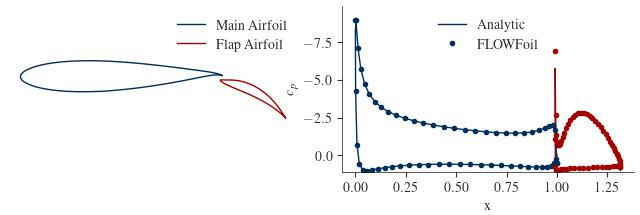
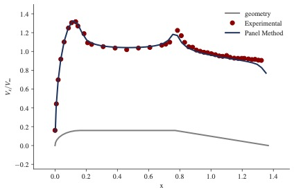

# Quick Start

FLOWFoil is structured as follows:
 - The user generates a `Problem`.
 - The `Problem` is solved, generating a `Solution`.
 - The `Solution` is post-processed, generating a `Polar`.

There are also some included convenience functions for geometry generation and manipulation.

## Single Airfoil Inviscid Solution

Let's first look at the simplest case, a single inviscid airfoil.
We'll first set up the geometry, then define the problem, then solve the problem, then post process it, and finally plot some of the outputs.

```@setup singleaf
using FLOWFoil
using PyPlot
```

#### Geometry Definition

For this example, we'll use one of the airfoil parameterization convenience functions to generate the x,z coordinates of an arbitrary Joukowsky airfoil.
FLOWFoil includes several such convenience functions, which you can find more information on the [API Reference](@ref) page.

```@example singleaf
## -- SET UP GEOMETRY

# arbitrarily pick some joukowsky airfoil parameters
center = [-0.1; 0.1]
radius = 1.0
num_nodes = 160

# get airfoil coordinates for joukowsky airfoil
x, z = FLOWFoil.joukowsky(center, radius; N=num_nodes)

# get analytic joukowsky solution for later, using alpha=4 and vinf = 1.0
vj, cpj, clj = FLOWFoil.joukowskyflow(center, radius, 4.0, 1.0; N=num_nodes)
```

!!! note
    For any airfoil coordinate generation method (from FLOWFoil or otherwise), the coordinates must start at the trailing edge, and proceed clockwise around the airfoil.

#### Generate Meshes
We'll next take that geometry and create a simple mesh object that holds the coordinates as well as pertinent information regarding the trailing edge.

```@docs
FLOWFoil.generate_mesh
```

```@example singleaf
# generate mesh object
meshes = [FLOWFoil.generate_mesh([x z])]
```

#### Define Problem
We'll define a problem using the mesh array we just created, and indicate that we want to solve the inviscid problem by setting the viscous keyword argument to false.
The problem object is very simple in the inviscid case, but carries more information about the freestream for the viscous problem (not yet implemented)

```@docs
FLOWFoil.Problem(meshes, angleofattack=0.0, reynolds=0.0, mach=0.0; viscous=true, verbose=false, debug=false)
```

```@example singleaf
## -- DEFINE PROBLEM
problem = FLOWFoil.Problem(meshes; viscous=false)
```

!!! note
    Even for single mesh objects, the meshes argument provided to the Problem constructor needs to be in an array.

#### Solve Problem
To solve the problem, we simply call the solve function, which will select the appropriate solver based on the viscous field in the problem.
The solver returns a solution object, which nominally contains the vortex strengths and constant freestream strength on each node, as well as the mesh objects used in the solution, and some book keeping items from multi-element analyses.

```@docs
FLOWFoil.solve
```

```@example singleaf
## -- SOLVE PROBLEM
inviscid_solution = FLOWFoil.solve(problem)
```

#### Post Process
With the solution calculated, we can post process by providing the angle of attack at which we want to know the various airfoil coefficients includeing lift and moment, as well as surface velocity and pressure distributions.

```@docs
FLOWFoil.inviscid_polar
```

```@example singleaf
## -- POST PROCESS SOLUTION
# arbitrarily pick an angle of attack
alpha = 4.0
polar = FLOWFoil.inviscid_polar(inviscid_solution, alpha)
```

Comparing our solution to the analytic solution we saved earlier, we see excellent agreement.


## Multiple Airfoil Inviscid Solution

For a multi-element airfoil system, the procedure is identical, except an array of meshes is used for the problem definition.
For this case, we'll use data that comes from "An Exact Test Case for the Plane Potential Flow About Two Adjacent Lifting Aerofoils" by B. R. Williams.

```@example
using FLOWFoil
using PyPlot

## -- SET UP GEOMETRY
include("two_inviscid_airfoils.jl")

# set freestream to unity
vinf = 1.0
re = 1.0

# arbitrarily pick an angle of attack
alpha = 0.0

# generate mesh object
meshes = [FLOWFoil.generate_mesh([ximain etamain]); FLOWFoil.generate_mesh([xiflap etaflap])]

## -- DEFINE PROBLEM
problem = FLOWFoil.Problem(meshes; viscous=false)

## -- SOLVE PROBLEM
inviscid_solution = FLOWFoil.solve(problem)

## -- POST PROCESS SOLUTION
polar = FLOWFoil.inviscid_polar(inviscid_solution, alpha)

```

Again, we see excellent agreement with the analytical solution.




## Axisymmetric Body of Revolution

FLOWFoil can also handle axisymmetric cases, including bodies of revolution which we domonstrate here.

```@example bor
using FLOWFoil
using PyPlot

include("../../test/data/bodyofrevolutioncoords.jl")
nothing #hide
```

To let the problem and solver know that you are modeling an axisymmetric system, generate your meshes using the `generate_axisym_mesh` function.
In addition, if you are modeling a body of revolution, that is, you have an open geometry at the axis of rotation, use the `bodyofrevolution` keyword argument.

```@docs
FLOWFoil.generate_axisym_mesh
FLOWFoil.AxiSymMesh
```

```@example bor
mesh = [FLOWFoil.generate_axisym_mesh(x, r; bodyofrevolution=true)]
```

You will also need to set the `axisymmetric` keyword argument to true in your problem definition.
```@example bor
problem = FLOWFoil.Problem(mesh; axisymmetric=true, viscous=false)
```

The solver function will know from the problem object which solver to use, and in this case will output a solution of type `AxiSymSolution`.

```@docs
FLOWFoil.AxiSymSolution
```

```@example bor
solution = FLOWFoil.solve(problem)
```

Finally, we can get the solution and plot the results

```@example bor

# get surface velocity at control points
cpx = [mesh[1].panels[i].controlpoint[1] for i in 1:length(solution.gammas)]
surface_velocity = solution.gammas
nothing #hide
```


