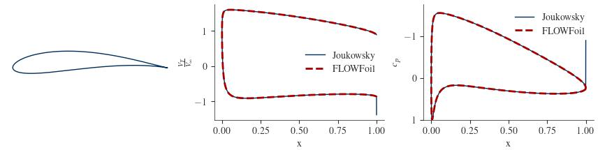
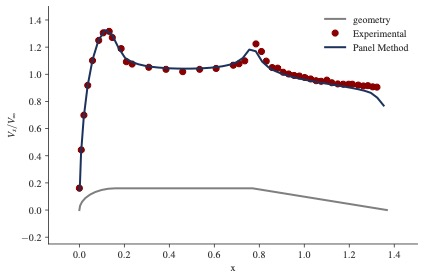
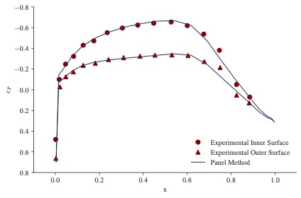
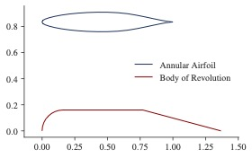
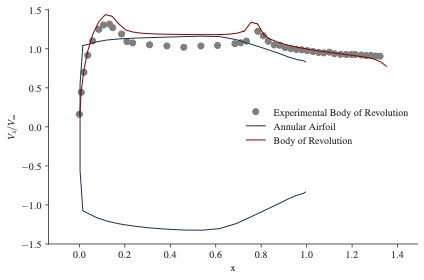
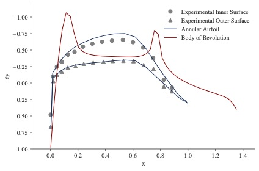

# Quick Start

FLOWFoil is structured as follows:
1. PROBLEM: The user generates a `Problem`.
2. SOLUTION: The `Problem` is solved, generating a `Solution`.
3. POLAR: The `Solution` is post-processed, generating a `Polar`.

There are also some included convenience functions for geometry generation and manipulation.

---

## Single Airfoil Inviscid Solution

Let's first look at the simplest case: a single inviscid airfoil.
We'll first set up the geometry, then define the problem, then solve the problem, then post process it, and finally plot some of the outputs.

```@setup singleaf
using FLOWFoil
using PyPlot
```

### Setup:

#### Define Geometry

For this example, we'll use one of the airfoil parameterization convenience functions to generate the x,z coordinates of an arbitrary Joukowsky airfoil.
FLOWFoil includes several such convenience functions, which you can find more information on the [API Reference](reference.md#Common-Airfoil-Parameterizations) page.

```@example singleaf
## -- SET UP GEOMETRY

# arbitrarily pick some joukowsky airfoil parameters
center = [-0.1; 0.1]
radius = 1.0
num_nodes = 160

# get airfoil coordinates for joukowsky airfoil
x, z = FLOWFoil.joukowsky(center, radius; N=num_nodes)

# get analytic joukowsky solution for later, using alpha=4 and vinf = 1.0
vj, cpj, clj = FLOWFoil.joukowskyflow(center, radius, 4.0, 1.0; N=num_nodes)

nothing #hide
```

!!! note
    For any airfoil coordinate generation method (from FLOWFoil or otherwise), the coordinates must start at the trailing edge, and proceed clockwise around the airfoil.

#### Generate Mesh
We'll next take the airfoil geometry and create a mesh object that holds the coordinates as well as pertinent information regarding the trailing edge.
(The trailing edge information is calculated automatically as part of the `generate_mesh` constructor.)

```@docs
FLOWFoil.generate_mesh
```

```@example singleaf
# generate mesh object
mesh = FLOWFoil.generate_mesh([x z])

nothing #hide
```

### Define Problem
We'll define a `Problem` object using the mesh we just created, and indicate that we want to solve the inviscid problem by setting the viscous keyword argument to false.
The problem object is very simple in the inviscid case, but carries more information about the freestream for the viscous problem (not yet implemented)

```@docs
FLOWFoil.Problem
```

```@example singleaf
## -- DEFINE PROBLEM
problem = FLOWFoil.Problem([mesh]; viscous=false)

nothing #hide
```

!!! note
    Even for single mesh objects, the mesh argument provided to the Problem constructor needs to be in an array.

### Solve Problem
To solve the `Problem`, we simply call the `solve` function, which will select the appropriate solver based on the viscous field in the problem.
The solver returns a solution, in this case an `InviscidSolution`, object, which nominally contains the vortex strengths on each node, as well as the mesh objects used in the solution, and some book keeping items from multi-element analyses.

```@docs
FLOWFoil.solve
FLOWFoil.InviscidSolution
```


```@example singleaf
## -- SOLVE PROBLEM
inviscid_solution = FLOWFoil.solve(problem)

nothing #hide
```

### Post Process Solution
With the solution calculated, we can post process by providing the angle of attack at which we want to know the various airfoil coefficients including lift and moment, as well as surface velocity and pressure distributions, all of which are returned as part of a polar object, in our case for this example: a `PlanarPolar`.

```@docs
FLOWFoil.get_planar_polar
FLOWFoil.PlanarPolar
```

```@example singleaf
## -- POST PROCESS SOLUTION
# arbitrarily pick an angle of attack
alpha = 4.0
polar = FLOWFoil.get_planar_polar(inviscid_solution, alpha)

nothing #hide
```

Comparing our solution to the analytic solution we saved earlier, we see excellent agreement.




---


## Multiple Airfoil Inviscid Solution

For a multi-element airfoil system, the procedure is identical, except the array of meshes contains more than one element.
For this case, we'll use data that comes from ["An Exact Test Case for the Plane Potential Flow About Two Adjacent Lifting Aerofoils" by B. R. Williams.](https://reports.aerade.cranfield.ac.uk/handle/1826.2/2993)

```@example
using FLOWFoil

## -- SET UP GEOMETRY
include("two_inviscid_airfoils.jl")

# set freestream to unity
vinf = 1.0
re = 1.0

# arbitrarily pick an angle of attack
alpha = 0.0

# generate mesh object
meshes = [FLOWFoil.generate_mesh([ximain etamain]); FLOWFoil.generate_mesh([xiflap etaflap])]

## -- DEFINE PROBLEM
problem = FLOWFoil.Problem(meshes; viscous=false)

## -- SOLVE PROBLEM
inviscid_solution = FLOWFoil.solve(problem)

## -- POST PROCESS SOLUTION
polar = FLOWFoil.get_planar_polar(inviscid_solution, alpha)

nothing #hide
```

Again, we see excellent agreement with the analytical solution.


---

## Axisymmetric Body of Revolution

FLOWFoil can also handle axisymmetric cases, including bodies of revolution which we domonstrate here.
For this example, we use data from chapter 4 of ["Vortex Element Methods for fluid Dynamic Analysis of Engineering Systems" by  R. I. Lewis](https://doi.org/10.1017/CBO9780511529542)

```@example bor
using FLOWFoil
using PyPlot

include("../../test/data/bodyofrevolutioncoords.jl")

nothing #hide
```

In order to have the correct flags associated with the axisymmetric solver, we generate the mehs using the `generate_axisym_mesh` function.
In addition, since we are modeling a body of revolution, that is, we have an open geometry at the axis of rotation, we need to include the `bodyofrevolution` keyword argument.

```@docs
FLOWFoil.generate_axisym_mesh
FLOWFoil.AxiSymMesh
```

```@example bor
mesh = [FLOWFoil.generate_axisym_mesh(x, r; bodyofrevolution=true)]

nothing #hide
```

We will also need to set the `axisymmetric` keyword argument to true in our problem definition.
```@example bor
problem = FLOWFoil.Problem(mesh; axisymmetric=true, viscous=false)

nothing #hide
```

The solver function will know from the problem object which solver to use, and since we have again selected `viscous=false` (noting that no viscous solver is yet implemented) we will again have an output of type `InviscidSolution`.

```@example bor
solution = FLOWFoil.solve(problem)

nothing #hide
```

With the solution, we can call the `get_axisymmetric_polar` function to generate an `AxiSymPolar` object containing the post-processed data.
Note that for the axisymmetric case, we have no angle of attack, so the inviscid solution itself is sufficient for the body of revolution case.

```@docs
FLOWFoil.get_axisymmetric_polar
FLOWFoil.AxiSymPolar
```

```@example bor

polar = FLOWFoil.get_axisymmetric_polar(solution)

# get surface velocity at control points
cpx = [mesh[1].panels[i].controlpoint[1] for i in 1:length(solution.panelgammas)]

#get velocity from polar object
surface_velocity = polar.surface_velocity

nothing #hide
```



---

## Axisymmetric Annular Airfoil (Duct)

If we define an airfoil shape in an axisymmetric scheme, we model an annular airfoil, or in other words, a duct.  To do so, we follow a similar procedure to bodies of revolution with the exception that we set `bodyofrevolution=false`.

!!! note
    No part of the geometry for a non-body of revolution can reside below z=0, otherwise an error will be thrown.

```@example aa
using FLOWFoil

include("../../test/data/naca_662-015.jl")

#Set bodyofrevolution to false
mesh = [FLOWFoil.generate_axisym_mesh(x, r, bodyofrevolution=false)]

problem = FLOWFoil.Problem(mesh; axisymmetric=true, viscous=false)

solution = FLOWFoil.solve(problem)

polar = FLOWFoil.get_axisymmetric_polar(solution)

# get control point x-locations
cpx = [mesh[1].panels[i].controlpoint[1] for i in 1:length(solution.panelgammas)]

cp = polar.surface_pressure

nothing #hide
```

As above, we plot experimental results along with our calculated values.



---


## Axisymmetric Mutli-element Systems

As an example of an multi-element axisymmetric system (such as that used for a ducted rotor), we will simply combine the two previous cases.
We proceed in the same manner for 2D (planar) multi-element systems in that we simply put the various mesh objects in an array together when defining the problem object.

```@example dr
using FLOWFoil

# create annular airfoil mesh object
include("../../test/data/naca_662-015.jl")
duct = FLOWFoil.generate_axisym_mesh(x, r; bodyofrevolution=false)

# create body of revolution mesh object
include("../../test/data/bodyofrevolutioncoords.jl")
hub = FLOWFoil.generate_axisym_mesh(x, r; bodyofrevolution=true)

# define problem with both mesh objects
problem = FLOWFoil.Problem([duct; hub]; axisymmetric=true, viscous=false)

solution = FLOWFoil.solve(problem)

# Post Processing

polar = FLOWFoil.get_axisymmetric_polar(solution)

# get surface velocity at control points
cpx = [(p -> p.controlpoint[1]).(duct.panels); (p -> p.controlpoint[1]).(hub.panels)]

#surface velocities
surface_velocity = polar.surface_velocity

#surface pressure coefficients
surface_pressure = polar.surface_pressure

nothing #hide
```

Plotting the geometry and the output velocities and pressures show expected behavior when combining these two cases.






